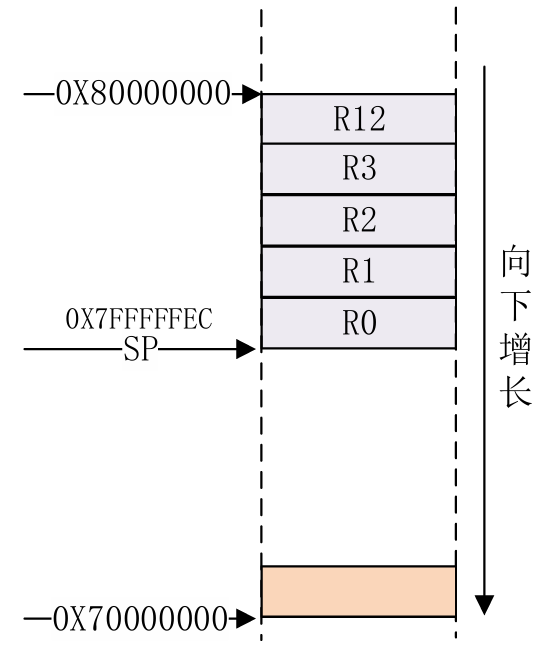
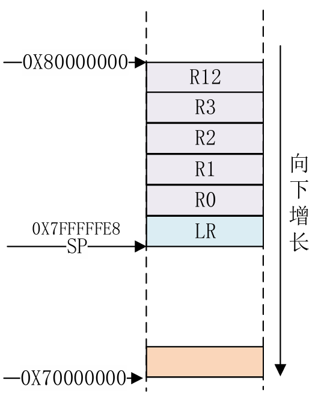

- [为什么要学习基础汇编？](#为什么要学习基础汇编)
- [GNU汇编语法](#gnu汇编语法)
  - [1、MDK/IAR 与 GNU 汇编语法差异](#1mdkiar-与-gnu-汇编语法差异)
  - [2、GNU 汇编语法结构](#2gnu-汇编语法结构)
  - [3、大小写规范](#3大小写规范)
  - [4、段定义与伪指令](#4段定义与伪指令)
  - [5、常用伪指令汇总](#5常用伪指令汇总)
  - [6、程序入口与标号定义](#6程序入口与标号定义)
  - [7、GNU 汇编函数定义格式](#7gnu-汇编函数定义格式)
- [常用汇编指令](#常用汇编指令)
  - [处理器内部数据传输指令(寄存器与寄存器之间数据传输)](#处理器内部数据传输指令寄存器与寄存器之间数据传输)
    - [1、MOV指令](#1mov指令)
    - [2、MRS指令](#2mrs指令)
    - [3、MSR指令](#3msr指令)
  - [存储器访问指令(寄存器与内存之间数据传输)](#存储器访问指令寄存器与内存之间数据传输)
    - [1?、LDR 指令（Load Register）](#1?ldr-指令load-register)
      - [功能](#功能)
      - [用途](#用途)
      - [示例代码：读取 GPIO1\_GDIR 寄存器值](#示例代码读取-gpio1_gdir-寄存器值)
    - [2?、STR 指令（Store Register）](#2?str-指令store-register)
      - [功能](#功能-1)
      - [示例代码：配置 GPIO1\_GDIR 寄存器值](#示例代码配置-gpio1_gdir-寄存器值)
    - [数据宽度问题](#数据宽度问题)
  - [压栈和出栈指令(后入先出)](#压栈和出栈指令后入先出)
    - [举例](#举例)
      - [另一种写法举例](#另一种写法举例)
  - [ARM 汇编跳转指令（感觉可以简单理解为函数跳转指令）](#arm-汇编跳转指令感觉可以简单理解为函数跳转指令)
    - [1?、跳转方式分类](#1?跳转方式分类)
    - [2?、常用跳转指令汇总](#2?常用跳转指令汇总)
    - [3?、B 指令详解（不可返回跳转）](#3?b-指令详解不可返回跳转)
      - [功能说明](#功能说明)
      - [示例：跳转到 C 的 `main` 函数](#示例跳转到-c-的-main-函数)
    - [4?、BL 指令详解（可返回跳转）](#4?bl-指令详解可返回跳转)
      - [功能](#功能-2)
      - [示例：中断服务中调用 C 函数](#示例中断服务中调用-c-函数)

# 为什么要学习基础汇编？
1. 大部分芯片在上电的时候并没有准备好c语言的环境，所以**第一行程序一定是汇编**的，具体要写多少看我们在什么时候可以准备好c语言的环境，保证c语言的正常运行。
2. C语言中的函数调用涉及到出栈入栈，出栈入栈就要对堆栈进行操作，所谓的堆栈其实就是一段内存，这段内存比较特殊，由SP指针访问，SP指针指向栈顶。芯片一上电Sp指针还没有初始化，所以C语言没法运行，对于有些芯片还需要初始化DDR，因为芯片本身没有RAM，或者内部RAM不开放给用户使用，用户代码需要在DDR中运行，因此一开始要用汇编来初始化DDR控制器。

# GNU汇编语法
## 1、MDK/IAR 与 GNU 汇编语法差异

- **MDK（Keil）和 IAR** 使用各自的汇编语法，不能直接通用
- **GNU 汇编（GAS）** 是 GCC 工具链使用的标准语法，适用于 ARM、RISC-V 等多种架构
- 在使用 GCC 编译器（如构建 I.MX6UL 启动代码或裸机程序）时，必须遵循 GNU 汇编语法规范

---

## 2、GNU 汇编语法结构

每行语句由三部分组成：

```
label: instruction @ comment
```

| 部分       | 说明 |
|------------|------|
| `label:`   | 标号，表示地址位置或数据标识，必须以冒号结尾 |
| `instruction` | 指令或伪指令，如 `ldr`, `mov`, `.global` 等 |
| `@ comment`   | 注释，等同于 C 的 `/* */`，也可使用 `@` 开头 |

示例：

```asm
add:
    MOVS R0, #0x12     @ 设置 R0 = 0x12
```

---

## 3、大小写规范

- 指令、伪指令、寄存器名可全大写或全小写
- **不能混用大小写**（如 `Mov R0, #1` 是非法的）

---

## 4、段定义与伪指令

GNU 汇编使用 `.section` 来定义段，常见段如下：

| 段名       | 说明 |
|------------|------|
| `.text`    | 代码段 |
| `.data`    | 初始化数据段 |
| `.bss`     | 未初始化数据段 |
| `.rodata`  | 只读数据段 |
| `.section .testsection` | 自定义段 |

---

## 5、常用伪指令汇总

| 伪指令       | 作用 |
|--------------|------|
| `.global symbol` | 定义全局符号（如 `_start`） |
| `.byte`      | 定义 1 字节数据 |
| `.short`     | 定义 2 字节数据 |
| `.long`      | 定义 4 字节数据 |
| `.equ name, value` | 定义常量 |
| `.align n`   | 数据对齐（如 `.align 4` 表示 4 字节对齐） |
| `.end`       | 文件结束标志 |

---

## 6、程序入口与标号定义

默认入口标号为 `_start`，可在链接脚本中通过 `ENTRY(_start)` 指定：

```asm
.global _start

_start:
    ldr r0, =0x12      @ 设置 R0 = 0x12
```

---

## 7、GNU 汇编函数定义格式

```asm
FunctionName:
    指令序列
    返回语句（可选）
```

示例：中断服务函数定义

```asm
/* 未定义中断 */
Undefined_Handler:
    ldr r0, =Undefined_Handler
    bx r0

/* SVC中断 */
SVC_Handler:
    ldr r0, =SVC_Handler
    bx r0

/* 预取终止中断 */
PrefAbort_Handler:
    ldr r0, =PrefAbort_Handler
    bx r0
```

- `FunctionName:` 是函数名
- `ldr r0, =FunctionName` 是函数体
- `bx r0` 是返回语句（跳转回自身或其他处理逻辑）

---
# 常用汇编指令
## 处理器内部数据传输指令(寄存器与寄存器之间数据传输)

1. 将数据从一个寄存器传递到另外一个寄存器
2. 将数据从一个寄存器传递到特殊寄存器，如CPSR和SPSR寄存器
3. 将立即数传递到寄存器
> CPSR(Current Program Status Register) 是 ARM 处理器的**当前程序状态寄存器**，而 SPSR(Saved Program Status Register) **是异常模式下用于保存 CPSR 的备份寄存器**。它们在异常处理、模式切换和中断控制中扮演关键角色。

### 1、MOV指令
| 指令       | 目标 |源|介绍|
|--------------|------|----|----|
|MOV|R0|R1|将R1寄存器的数据复制到R0之中|
```asm
MOV R0， R1   @将寄存器R1中的数据传递给R0，即R0=R1 
MOV R0,  #0X12 @将立即数0X12传递给R0寄存器，即R0=0X12
```

### 2、MRS指令
| 指令       | 目标 |源|介绍|
|--------------|------|----|----|
|MOV|R0|CPSR|将CPSR寄存器的数据复制到R0之中|
```asm
MRS R0, CPSR @将特殊寄存器CPSR里面的数据传递给R0，即R0=CPSR 
```

### 3、MSR指令
| 指令       | 目标 |源|介绍|
|--------------|------|----|----|
|MOV|CPSR|R0|将普通寄存器的数据复制到CPSR寄存器之中|
```asm
MRS CPSR, R0 @将普通寄存器的数据复制到CPSR寄存器之中
```

## 存储器访问指令(寄存器与内存之间数据传输)
1. ARM并不能够直接访问存储器，比如RAM之中的数据（随机访问存储器）：程序运行时的数据区、堆栈、全局变量等都在这里。
2. 用汇编来配置I.MX6UL寄存器的时候需要借助存储器访问指令，这里所指的**I.MX6UL寄存器**我想来做一下说明
> I.MX6UL 的寄存器是“内存映射寄存器”
在 I.MX6UL 这类 SoC 中：
外设寄存器（如 GPIO、UART、I2C）都映射在特定的内存地址范围
虽然叫“寄存器”，但本质上是 RAM 类型的地址空间


---

### 1?、LDR 指令（Load Register）

#### 功能
- 从存储器地址加载数据到寄存器 Rx 中
- 也可用于加载立即数（使用 `=` 而非 `#`）

#### 用途
- 读取外设寄存器值
- 加载常量地址或数据
- 访问结构体、数组、寄存器映射地址

#### 示例代码：读取 GPIO1_GDIR 寄存器值

```asm
LDR R0, =0x0209C004      @ 将 GPIO1_GDIR 地址加载到 R0 中
LDR R1, [R0]             @ 读取该地址的值到 R1 中
```

- `R0` 保存寄存器地址
- `R1` 保存读取到的寄存器值
- 此处未使用 offset，默认偏移为 0

---

### 2?、STR 指令（Store Register）

#### 功能
- 将寄存器中的数据写入指定内存地址
- 常用于配置外设寄存器或写入 RAM

#### 示例代码：配置 GPIO1_GDIR 寄存器值

```asm
LDR R0, =0x0209C004      @ 加载 GPIO1_GDIR 地址到 R0
LDR R1, =0x20000002      @ 加载要写入的值到 R1
STR R1, [R0]             @ 将 R1 的值写入 GPIO1_GDIR,要说明的是这个[]就类似于c语言之中的解引用
```

- `R1` 中的值写入 `R0` 指向的地址
- 实现对 GPIO 引脚方向的配置

---

### 数据宽度问题

默认情况下，`LDR` 和 `STR` 操作的是 **字（Word）= 32 位数据**。如果需要按字节或半字操作，可以使用以下扩展指令：

| 指令    | 数据宽度 | 说明 |
|---------|-----------|------|
| `LDR` / `STR`   | 32 位 | 按字访问 |
| `LDRH` / `STRH` | 16 位 | 按半字访问 |
| `LDRB` / `STRB` | 8 位  | 按字节访问 |

---

## 压栈和出栈指令(后入先出)
我们通常会在A函数之中对B函数进行调用，但是在调用完成之后我们依然需要再回到A函数之中继续进行执行操作。如果我们想要完成这样的效果那么就必须要在这之前对寄存器进行保存！
因此
保存R0~R15寄存器的操作就叫做现场保护（这个时候就需要进行压栈操作），恢复R0~R15寄存器的操作就叫做恢复现场（这个时候就需要进行出栈操作）。
压栈的指令为`PUSH`出栈的指令为`POP`，都是多存储和多加载指令，也就是说可以一次操作多个寄存器数据
### 举例
```asm
PUSH {R0~R3, R12} @将R0~R3和R12压栈
```
图中的SP指针（Stack Pointer） 是一个专用寄存器，指向当前栈顶地址

假如这个时候我们要接着进行压栈操作

```asm
PUSH {LR} @将LR进行压栈 
```

因为这是一个后入先出的过程，这个时候我们出栈就是从栈顶开始`POP`
```asm
POP {LR}  @先恢复LR 
POP {R0~R3,R12} @在恢复R0~R3,R12
```
#### 另一种写法举例
```asm
1 STMFD SP!,{R0~R3, R12}    @R0~R3,R12 入栈 
2 STMFD SP!,{LR}              @LR 入栈 
4 LDMFD SP!, {LR}            @先恢复LR 
5 LDMFD SP!, {R0~R3, R12}   @再恢复R0~R3, R12
```
STMFD 可以分为两部分：STM和FD，同理，LDMFD也可以分为LDM和FD。看到STM和LDM有没有觉得似曾相识前面我们讲了LDR和STR，这两个是数据加载和存储指令，但是每次只能读写存储器中的一个数据。STM和LDM就是多存储和多加载，可以连续的读写存储器中的多个连续数据。

当然可以，中原！以下是对你提供内容的**结构化整理与专业归纳**，适用于嵌入式开发文档、教学材料或项目说明书，尤其针对 ARM 汇编中的跳转指令使用场景。

---

## ARM 汇编跳转指令（感觉可以简单理解为函数跳转指令）

---

### 1?、跳转方式分类

| 类型 | 描述 |
|------|------|
| ① 直接跳转指令 | 使用 `B`, `BL`, `BX`, `BLX` 等指令完成跳转 |
| ② 修改 PC 寄存器 | 通过向 `PC` 写入地址实现跳转（不推荐） |

PC 寄存器的基本作用Program Counter（程序计数器）
保存的是 下一条要执行指令的地址每执行一条指令，PC 自动更新（通常加 4，因为 ARM 指令是 32 位）

---

### 2?、常用跳转指令汇总

| 指令 | 说明 |
|------|------|
| `B <label>` | 跳转到标号位置，适用于不可返回的跳转 |
| `BL <label>` | 跳转到标号位置，并将返回地址保存到 `LR` |
| `BX <Rm>` | 跳转到寄存器 `Rm` 指定的地址，支持指令集切换 |
| `BLX <Rm>` | 跳转到 `Rm` 指定地址，同时保存返回地址到 `LR`，并切换指令集 |
| `B.W <label>` | 32 位版本的 `B` 指令，支持更远距离跳转（±16MB） |

---

### 3?、B 指令详解（不可返回跳转）

#### 功能说明
- 将 `PC` 设置为目标地址
- 不保存返回地址
- 适用于程序入口或不可返回的跳转

#### 示例：跳转到 C 的 `main` 函数

```asm
_start:
    ldr sp, =0x80200000     @ 初始化栈指针
    b main                  @ 跳转到 main 函数（不可返回）
```

说明：
- 常用于裸机启动代码
- 初始化完运行环境后，跳转到 C 语言入口点
- 不再返回汇编代码

---

### 4?、BL 指令详解（可返回跳转）

#### 功能
- 跳转前将当前 `PC` 保存到 `LR`（R14）
- 可通过 `BX LR` 返回调用点
- 适用于函数调用、异常处理等需要返回的场景

#### 示例：中断服务中调用 C 函数

```asm
    push {r0, r1}              @ 保存现场
    cps #0x13                  @ 切换到 SVC 模式
    bl system_irqhandler       @ 调用 C 语言中断处理函数
    cps #0x12                  @ 切换回 IRQ 模式
    pop {r0, r1}               @ 恢复现场
    str r0, [r1, #0x10]        @ 写入 EOIR，结束中断
```

说明：
- `BL` 保证中断处理函数执行完后能返回继续执行后续指令
- `system_irqhandler` 是 C 函数入口，由汇编跳转调用
- `LR` 保存返回地址，供中断恢复使用

---

